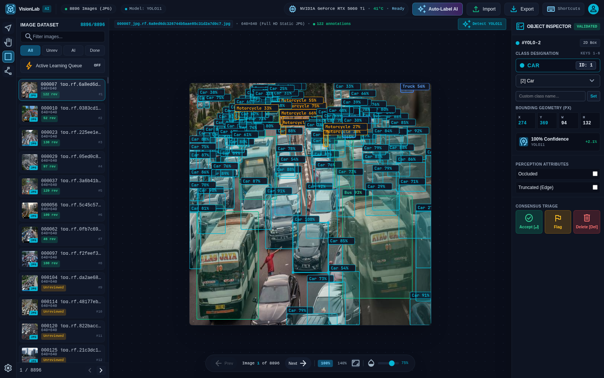
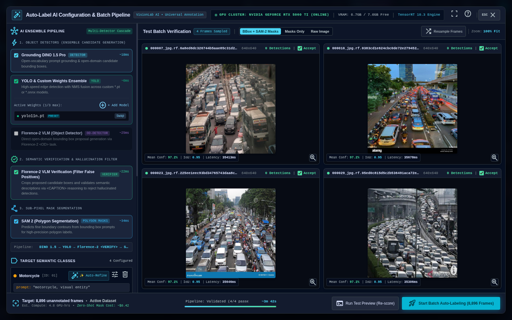
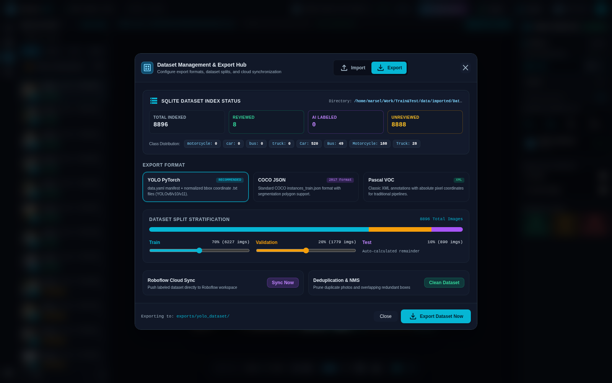
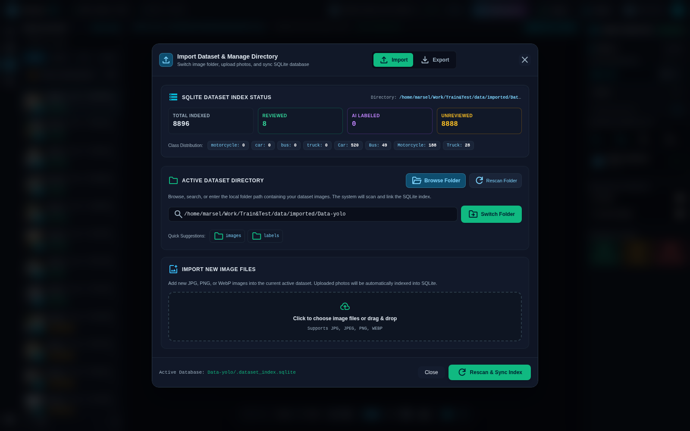
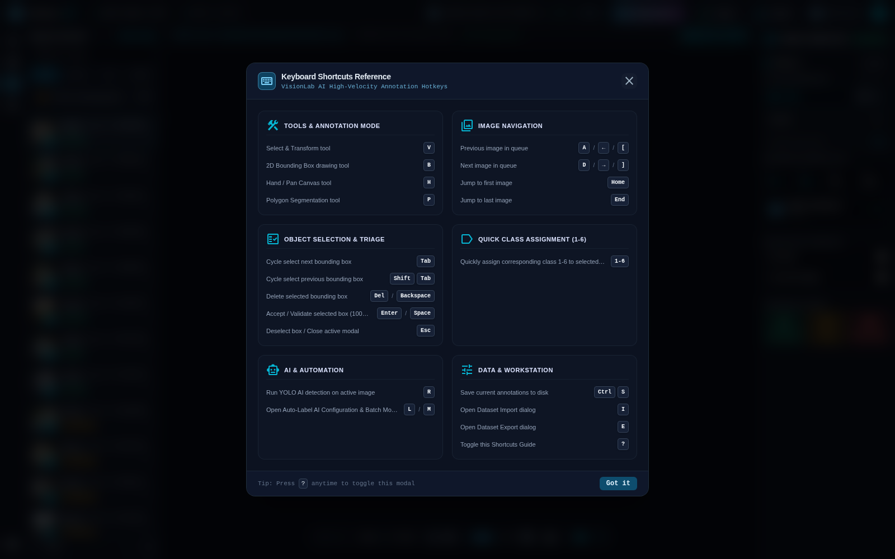

# VisionLab

> Universal AI-assisted visual annotation studio and computer vision dataset curation platform.

VisionLab is a general-purpose, high-performance visual annotation platform designed to annotate **anything**—from everyday objects, people, and retail products to specialized industrial, biomedical, robotic, and agricultural imagery. Built with a modern desktop interface (Tauri v2 + React 19) backed by a local GPU-accelerated Python AI engine (YOLO11, SAM 2, Grounding DINO, and Florence-2 VLM).

---

## Quick Start (One-Click Launch)

VisionLab features a **zero-configuration, self-bootstrapping single launcher** that works out-of-the-box on both Windows and Linux without manual environment setup:

| Platform | One-Click Launch | Run from Terminal | Force Standalone Qt GUI |
| :--- | :--- | :--- | :--- |
| **Windows** | Double-click `run.bat` | `run.bat` | `run.bat --qt` |
| **Linux** | Double-click `run.bat` / `run.sh` | `./run.sh` or `./run.bat` | `./run.sh --qt` |

> **First-time users**: The launcher automatically checks for `uv` and Python dependencies, sets up the `.venv` virtual environment, starts the background AI engine, and boots the studio window automatically. If any error occurs, the terminal stays open with helpful diagnostics instead of closing abruptly.

---

## Table of Contents

- [Studio Tour & Visual Walkthrough](#studio-tour--visual-walkthrough)
  - [1. Main Studio Workspace](#1-main-studio-workspace)
  - [2. Auto-Label AI Configuration & Batch Pipeline](#2-auto-label-ai-configuration--batch-pipeline)
  - [3. Dataset Management & Export Hub](#3-dataset-management--export-hub)
  - [4. Dataset Import & Directory Management](#4-dataset-import--directory-management)
  - [5. High-Velocity Keyboard Shortcuts](#5-high-velocity-keyboard-shortcuts)
- [Key Features](#key-features)
- [Getting Started](#getting-started)
  - [One-Click Launch](#one-click-launch)
  - [Development Setup](#development-setup)
- [Standalone Distribution & Packaging](#standalone-distribution--packaging)
- [Core AI Engines & Programmatic API](#core-ai-engines--programmatic-api)

---

## Studio Tour & Visual Walkthrough

### 1. Main Studio Workspace



The **Main Studio Workspace** provides an ergonomic, dark-themed environment optimized for high-throughput visual annotation:

- **Top Navigation & Telemetry Bar**:
  - **Brand & Model Status**: Displays current active model (e.g., `YOLO11`) and dataset image counter.
  - **GPU Hardware Telemetry**: Live telemetry of connected GPU device (e.g., `RTX 5060 Ti`), operational temperature, and free VRAM.
  - **Quick Action Triggers**: Instant access to **Auto-Label AI**, **Import**, **Export**, and **Shortcuts** (`?`).
- **Left Activity Rail**:
  - Quick-switch tools: **Select/Transform** (`V`), **2D Bounding Box** (`B`), **Hand/Pan** (`H`), **Polygon Segmentation** (`P`), and settings.
- **Image Queue Drawer**:
  - Displays thumbnail previews, image filenames, resolutions, and current validation tags (`Reviewed`, `Unreviewed`, `AI Labeled`).
  - Search and filter bar by status or keyword.
  - **Active Learning Priority Queue**: When toggled, automatically prioritizes the most informative, uncertain, or crowded frames for human verification.
- **Interactive Central Canvas**:
  - High-precision SVG bounding box overlays with color-coded class palettes and confidence ratings.
  - Smooth pan and zoom controls (10% to 500%), full-frame fit, and label opacity adjustment slider.
  - Quick **Detect (R)** button for single-frame AI inference.
- **Right Object Inspector**:
  - **Active Class Pill**: High-contrast indicator displaying the selected box's class name and ID.
  - **Dynamic Class Selector & Quick Custom Input**: Select from existing classes or type any custom class name and press `Enter` / `Set`.
  - **Bounding Geometry (PX)**: Real-time readouts of `X`, `Y`, `Width`, and `Height`.
  - **Model Confidence**: Displays detection probability and model origin.
  - **Perception Attributes**: Toggle flags for `Occluded` or `Truncated (Edge)`.
  - **Consensus Triage**: One-click actions to **Accept** (`Enter`/`Space`), **Flag**, or **Delete** (`Del`/`Backspace`).

---

### 2. Auto-Label AI Configuration & Batch Pipeline



The **Auto-Label AI Modal** (`L` or `M`) enables zero-shot and few-shot automated labeling across entire datasets using an ensemble of foundation models:

- **AI Ensemble Pipeline Configuration**:
  - **Object Detectors**:
    - **Grounding DINO 1.5 Pro**: Open-vocabulary natural language prompt grounding for open-domain bounding box candidate generation.
    - **YOLO & Custom Weights Ensemble**: High-speed edge detection with NMS fusion across standard YOLO models (`yolo11n.pt`, `yolov8x.pt`) or user-provided custom weights (`.pt`/`.onnx`).
    - **Florence-2 VLM Detector**: Dense proposal generation via Florence-2 `<OD>` vision-language tasks.
  - **Semantic Verification & Hallucination Filter**:
    - **Florence-2 VLM Verification**: Crops proposed bounding boxes and verifies semantic content against prompts to eliminate false positives.
  - **Sub-Pixel Mask Segmentation**:
    - **SAM 2 (Segment Anything Model 2)**: Predicts fine boundary polygon contours from bounding box prompts for instant instance segmentation masks.
- **Target Semantic Classes Editor**:
  - Define any arbitrary class names and descriptive visual prompts (e.g. `object, visual entity`).
  - **Auto-Refine**: Uses AI to automatically expand class names into rich visual descriptions.
- **Batch Verification & Execution**:
  - Preview detections live on sample frames before launching batch inference across the entire dataset.

---

### 3. Dataset Management & Export Hub



The **Export Hub** (`E`) allows exporting annotated datasets into standard computer vision training formats:

- **SQLite Dataset Index Status**: Displays overall counts for total indexed frames, unreviewed, reviewed, AI-labeled, and per-class distribution histograms.
- **Supported Export Formats**:
  - **YOLO PyTorch (Recommended)**: Exports `data.yaml` manifest and normalized bounding box `.txt` coordinates formatted for Ultralytics YOLOv8 / YOLOv11 / YOLOv26 training.
  - **COCO JSON**: Standard `annotations.json` with segmentation polygons and bounding boxes.
  - **Pascal VOC**: Classic XML annotations for legacy pipelines.
  - **Google Colab Package**: 1-click standalone `.zip` archive containing `data.yaml`, `images/`, and `labels/` ready for immediate Colab GPU training.
- **Interactive Dataset Split Stratification**:
  - Interactive dual-handled slider for configuring reproducible **Train / Validation / Test** percentage splits (e.g. 70% / 20% / 10%).
- **Roboflow Cloud Sync & Deduplication**:
  - Direct synchronization with Roboflow workspaces.
  - Automated NMS and IoU-based deduplication to prune redundant duplicate photos and overlapping boxes.

---

### 4. Dataset Import & Directory Management



The **Import Hub** (`I`) allows loading new image collections and third-party datasets into VisionLab:

- **Active Dataset Directory**:
  - Browse and select any local folder containing images or datasets.
  - Automatically scans and builds an ultra-fast SQLite index of all images and labels.
- **Import New Image Files**:
  - Drag and drop or browse JPG, PNG, and WebP images.
  - Automatically copies and registers incoming files into the workspace.
- **Dataset Compatibility**:
  - Seamlessly imports existing YOLO `data.yaml` projects, COCO `annotations.json` datasets, and Roboflow Universe exports.

---

### 5. High-Velocity Keyboard Shortcuts



VisionLab is built for maximum annotation speed with extensive hotkeys (`?` or `F1`):

| Category | Shortcut | Action |
| :--- | :--- | :--- |
| **Tools** | `V` | Select & Transform tool |
| | `B` | 2D Bounding Box drawing tool |
| | `H` | Hand / Pan Canvas tool |
| | `P` | Polygon Segmentation tool |
| **Navigation** | `A` / `[` / `←` | Previous image in queue |
| | `D` / `]` / `→` | Next image in queue |
| | `Home` | Jump to first image |
| | `End` | Jump to last image |
| **Triage** | `Tab` | Cycle select next bounding box |
| | `Shift + Tab` | Cycle select previous bounding box |
| | `Enter` / `Space` | Accept / Validate selected box (100% confidence) |
| | `Del` / `Backspace` | Delete selected bounding box |
| | `Esc` | Deselect active box / Close open modal |
| **Quick Classes** | `1` - `6` | Assign corresponding class 1 to 6 to selected object |
| **AI Actions** | `R` / `Ctrl + Enter` | Run AI detection on active frame |
| | `L` / `M` | Open Auto-Label AI Configuration modal |
| **Project** | `Ctrl + S` | Save current annotations to disk |
| | `I` | Open Dataset Import dialog |
| | `E` | Open Dataset Export dialog |
| | `?` | Toggle Shortcuts Guide |

---

## Key Features

- **Universal & Unbiased**: Annotate any objects without predefined class restrictions or domain constraints.
- **Multi-Model AI Foundation**: Integrates state-of-the-art architectures (Grounding DINO 1.5, YOLO11, SAM 2, Florence-2 VLM).
- **Active Learning & Disagreement Ranking**: Automatically scores image difficulty based on model disagreement, density, occlusion, and missing boxes to surface edge cases.
- **Smart Overlap Pruning & Deduplication**: Removes duplicate annotations across model proposals while preserving nested or multi-class valid detections.
- **Cross-Platform**: Standalone native desktop app for Windows (x64 installer / portable EXE) and Linux (Ubuntu 22.04 / 24.04 & Jetson Orin).

---

## Getting Started

### One-Click Launch (Unified Launcher)

VisionLab provides a single polyglot launcher ([`run.bat`](file:///home/marsel/Work/ImageAnnotator/run.bat) / [`run.sh`](file:///home/marsel/Work/ImageAnnotator/run.sh)) that runs natively on both Windows and Linux.

#### On Windows
- **One-Click**: Simply double-click `run.bat` in Windows File Explorer.
- **Terminal**: Run `run.bat` (or `run.bat --qt` for the standalone PySide6 Qt GUI) from CMD or PowerShell.

#### On Linux
- **One-Click**: Double-click `run.bat` or `run.sh` in your desktop file manager (or right-click → *Run as a Program*).
- **Terminal**:
  ```bash
  ./run.sh          # Launches Tauri Desktop Studio + AI Engine
  ./run.sh --qt     # Launches standalone PySide6 Qt GUI
  ```

#### How the Launcher Works (Zero-Friction Setup)
1. **Self-Bootstrapping**: If `uv` is not installed, it automatically installs `uv`. If `.venv` does not exist, it runs `uv sync` to install all locked dependencies automatically on first run.
2. **GPU & Display Telemetry**: On Linux, it automatically configures NVIDIA WebKitGTK and X11 display parameters.
3. **Background AI Engine**: Starts the local FastAPI engine (`app.api.server`) on `http://127.0.0.1:8765`, polls its `/api/health` endpoint until online, and cleans up the background server upon exit.
4. **Desktop Studio Interface**: Installs npm dependencies in `desktop/` if missing and opens the high-performance Tauri v2 + React 19 studio window.
5. **Persistent Error Reporting**: If a dependency or hardware issue occurs, the command prompt window stays open (`pause` on Windows / `read -p` on Linux) with error diagnostics instead of closing abruptly.

---

### Development Setup

#### Prerequisites
- [uv](https://github.com/astral-sh/uv) (ultra-fast Python package installer)
- Python 3.12+
- Node.js 20+ & npm

#### 1. Setup Backend
```bash
# Clone the repository
git clone https://github.com/Marsel204/VisionLabs.git
cd VisionLabs

# Sync locked Python dependencies
uv sync --extra dev

# Run test suite
uv run pytest
```

#### 2. Setup Frontend Studio
```bash
cd desktop
npm install
npm run dev
```

The web studio is accessible at `http://localhost:1420`, connecting to the Python engine on `http://127.0.0.1:8765`.

---

## Standalone Distribution & Packaging

### Windows Executable (.exe)
To compile a fully self-contained portable Windows distribution (no Python installation required):
```powershell
powershell -ExecutionPolicy Bypass -File .\scriptsuild_windows_exe.ps1
```
Output:
- `dist/VisionLab/VisionLab.exe`: Standalone portable distribution folder.
- `dist/VisionLab-windows-x64.zip`: Portable ZIP release package.

### Windows Setup Wizard (.exe)
Compile `installer.iss` with [Inno Setup](https://jrsoftware.org/isinfo.php):
```cmd
"C:\Program Files (x86)\Inno Setup 6\ISCC.exe" installer.iss
```
Output: `dist/VisionLab-Setup.exe`.

---

## Core AI Engines & Programmatic API

VisionLab also provides standalone Python services that can be imported directly into Python workflows:

### Label Fusion Engine
```python
from app.services.fusion import FusionEngine

# Fuse multi-model detections and eliminate hallucinations
result = FusionEngine().fuse([grounding_dino_detection, yolo_detection])
for item in result.detections:
    print(item.class_name, item.status, item.bbox)
```

### Active Learning Engine
```python
from app.services.active_learning import ActiveLearningConfig, ActiveLearningEngine

engine = ActiveLearningEngine(ActiveLearningConfig())
ranked_images = engine.score_many(analyses, max_workers=8)
for item in ranked_images[:10]:
    print(item.image_path, item.difficulty_score, item.recommended_action)
engine.close()
```

### Dataset Exporter
```python
from app.export.exporters import YoloExporter, split_documents

splits = split_documents(documents, train=0.7, val=0.2, test=0.1, seed=42)
exporter = YoloExporter(splits=splits)
exporter.export(documents, destination_dir)
```

---

## License

Apache 2.0 / MIT. Developed by Marsel204 for [VisionLabs](https://github.com/Marsel204/VisionLabs).
